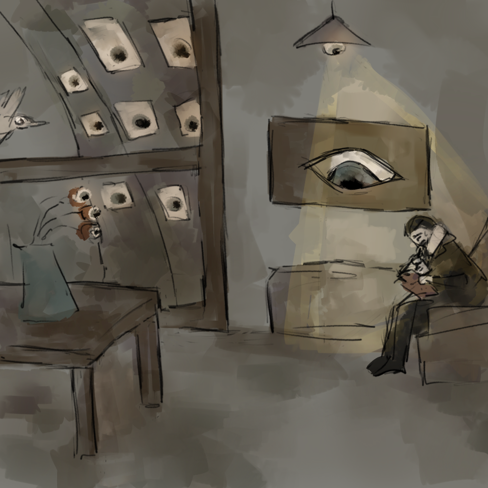

# Big Brother is Watching

You can find "slides"/ demos in separate [GitHub repo](https://github.com/bielawb/big-brother).

## Abstract

Working with servers is easy: if all else fails, you can force yourself to use remote desktop. But what if you want to investigate an issue on a client machine, with user present, logged in and working? In this session I go into details of troubleshooting issues remotely, when PowerShell remoting is all you can use, and client operating system is your target.

## Recording

Session was recorded, you can find video on YouTube:

